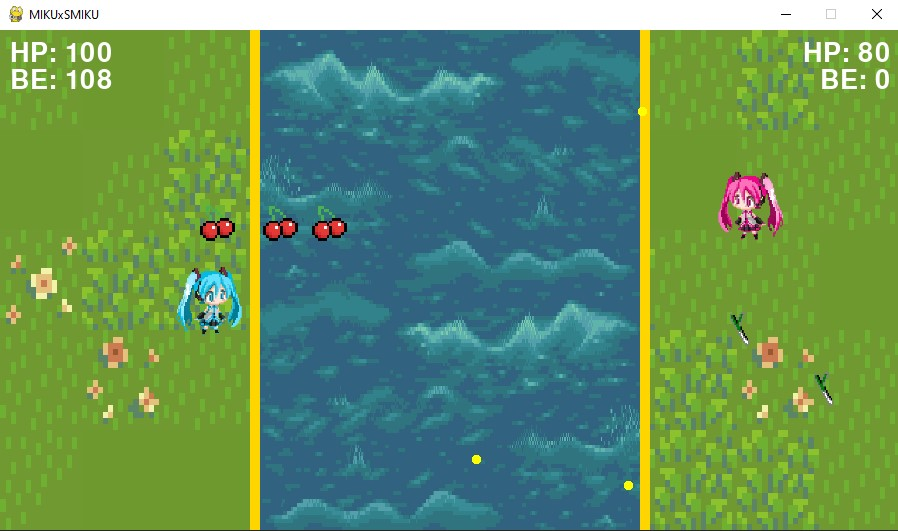

# MikuXSmiku
Python game made with Tkinter and Turtle

A fun little project I took on to make a game in Python. Play as the famous Hatsune Miku or Sakura Miku and throw leeks and cherries and each other until one player's HP falls below zero! Fire projectiles at orbs (Battle Ether) to earn points which can be used to activate abilities (Large Projectile/Healing)! All of this while listening to Hatsune Miku's hit songs!

Note: The assets are NOT made by me. Credits for the ultimate splash screen images are from [Grand Summoners](https://global.grandsummoners.com/).
